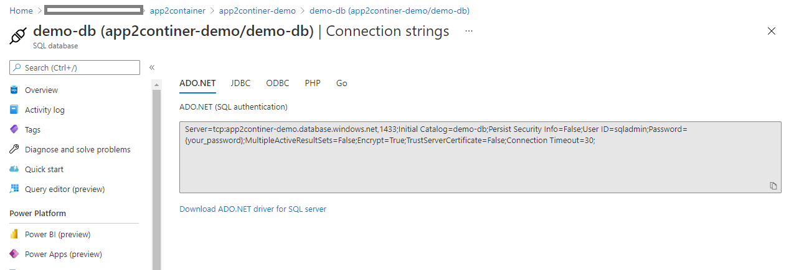
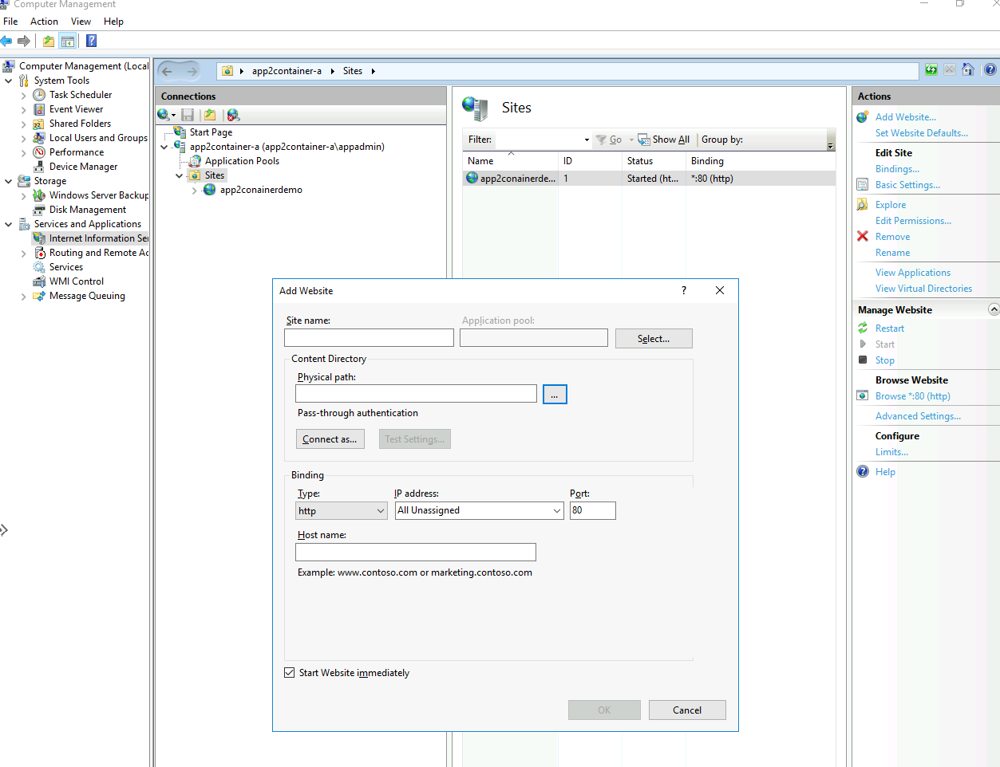

# ASP.NET App Containerization Demonstration

In this exercise, you'll learn how to:

> * Install the Azure Migrate: App Containerization tool.
> * Deploy a sample ASP.NET application on the server.
> * Perform application discovery on the server
> * Build the container image.
> * Deploy the containerized application on AKS.

## Download and install the Azure Migrate: App Containerization tool

1. Login into the tool client VM you created during the environment setup.
2. [Download](https://go.microsoft.com/fwlink/?linkid=2134571) the Azure Migrate: App Containerization installer on a Windows machine.
3. Launch PowerShell in administrator mode and change the PowerShell directory to the folder containing the installer.
4. Run the installation script using the command

   ```powershell
   .\AppContainerizationInstaller.ps1
   ```

## Launch the App Containerization tool

1. Open a browser on any machine that can connect to the Windows machine running the App Containerization tool, and open the tool URL: **https://*machine name or IP address*: 44369**.

   Alternately, you can open the app from the desktop by selecting the app shortcut.

2. If you see a warning stating that says your connection isn’t private, click Advanced and choose to proceed to the website. This warning appears as the web interface uses a self-signed TLS/SSL certificate.
3. At the sign-in screen, use the local administrator account on the machine to sign-in.
4. For specify application type, select **ASP.NET web apps** as the type of application you want to containerize.

    


### Complete tool pre-requisites
1. Accept the **license terms**, and read the third-party information.
6. In the tool web app > **Set up prerequisites**, do the following steps:
   - **Connectivity**: The tool checks that the Windows machine has internet access. If the machine uses a proxy:
     - Click on **Set up proxy** to specify the proxy address (in the form IP address or FQDN) and listening port.
     - Specify credentials if the proxy needs authentication.
     - Only HTTP proxy is supported.
     - If you've added proxy details or disabled the proxy and/or authentication, click on **Save** to trigger connectivity check again.
   - **Install updates**: The tool will automatically check for latest updates and install them. You can also manually install the latest version of the tool from [here](https://go.microsoft.com/fwlink/?linkid=2134571).
   - **Install Microsoft Web Deploy tool**: The tool will check that the Microsoft Web Deploy tool is installed on the Windows machine running the Azure Migrate: App Containerization tool.
   - **Enable PowerShell remoting**: The tool will inform you to ensure that PowerShell remoting is enabled on the application servers running the ASP.NET applications to be containerized.

## Deploy a sample ASP.NET application on the server

Unzip the *appfiles.zip* file in the same folder of this repository, open the *Web.config* file, in the *connectionStrings* section, paste the connection string you obtained from the sql server you deployed through the ARM template in the environment setup section.

```xml
  <connectionStrings>
    <add name="app2containerdemostr" connectionString="YOUR CONNECTION STRING" />
  </connectionStrings>
```


To deploy a sample ASP.NET application on the server, login to the windows application server created during the environment setup using Azure bastion. Once logged into the server, go to **Computer Management** -> **Services and Applications** -> **Internet Information Services Manager**. In the panel, under the **Sites**, right click **Add Website**.



Paste all the unzipped application files into a specific folder on the application server and specify the folder in the *Physical path*. Name the site and click *OK* to publish the application on the server. To verify the application has been successfully deployed, go to http://localhost:80 and in the *About* tab you will be able to see the databases that the server the application connected to.


## Log in to Azure

Click **Login** to log in to your Azure account.

1. You'll need a device code to authenticate with Azure. Clicking on Login will open a modal with the device code.
2. Click on **Copy code & Login** to copy the device code and open an Azure Login prompt in a new browser tab. If it doesn't appear, make sure you've disabled the pop-up blocker in the browser.

    

3. On the new tab, paste the device code and complete log in using your Azure account credentials. You can close the browser tab after log in is complete and return to the App Containerization tool's web interface.
4. Select the **Azure tenant** that you want to use.
5. Specify the **Azure subscription** that you want to use.

## Discover ASP.NET applications

The App Containerization helper tool connects remotely to the application servers using the provided credentials and attempts to discover ASP.NET applications hosted on the application servers.

1. Specify the **IP address/FQDN and the credentials** of the server running the ASP.NET application that should be used to remotely connect to the server for application discovery.
    - The credentials provided must be for a local administrator (Windows) on the application server.
    - For domain accounts (the user must be an administrator on the application server), prefix the username with the domain name in the format *<domain\username>*.
    - You can run application discovery for upto five servers at a time.

2. Click **Validate** to verify that the application server is reachable from the machine running the tool and that the credentials are valid. Upon successful validation, the status column will show the status as **Mapped**.  

    

3. Click **Continue** to start application discovery on the selected application servers.

4. Upon successful completion of application discovery, you can select the list of applications to containerize.

    


4. Use the checkbox to select the applications to containerize.
5. **Specify container name**: Specify a name for the target container for each selected application. The container name should be specified as <*name:tag*> where the tag is used for container image. For example, you can specify the target container name as *appname:v1*.   

### Parameterize application configurations
Parameterizing the configuration makes it available as a deployment time parameter. This allows you to configure this setting while deploying the application as opposed to having it hard-coded to a specific value in the container image. For example, this option is useful for parameters like database connection strings.
1. Click **app configurations** to review detected configurations.
2. Select the checkbox to parameterize the detected application configurations.
3. Click **Apply** after selecting the configurations to parameterize.

   


## Build container image


1. **Select Azure Container Registry**: Use the dropdown to select an Azure Container Registry that will be used to build and store the container images for the apps. You can use an existing Azure Container Registry or choose to create a new one using the Create new registry option.

    


2. **Review the Dockerfile**: The Dockerfile needed to build the container images for each selected application are generated at the beginning of the build step. Click **Review** to review the Dockerfile. You can also add any necessary customizations to the Dockerfile in the review step and save the changes before starting the build process.

3. **Trigger build process**: Select the applications to build images for and click **Build**. Clicking build will start the container image build for each application. The tool keeps monitoring the build status continuously and will let you proceed to the next step upon successful completion of the build.

4. **Track build status**: You can also monitor progress of the build step by clicking the **Build in Progress** link under the status column. The link takes a couple of minutes to be active after you've triggered the build process.  

5. Once the build is completed, click **Continue** to specify deployment settings.

    

## Deploy the containerized app on AKS

Once the container image is built, the next step is to deploy the application as a container on [Azure Kubernetes Service (AKS)](https://azure.microsoft.com/services/kubernetes-service/).

1. **Select the Azure Kubernetes Service Cluster**: Specify the AKS cluster that the application should be deployed to.

     - The selected AKS cluster must have a Windows node pool.
     - The cluster must be configured to allow pulling of images from the Azure Container Registry that was selected to store the images.
         - Run the following command in Azure CLI to attach the AKS cluster to the ACR.
           ``` Azure CLI
           az aks update -n <cluster-name> -g <cluster-resource-group> --attach-acr <acr-name>
           ```  
     - If you don’t have an AKS cluster or would like to create a new AKS cluster to deploy the application to, you can choose to create on from the tool by clicking **Create new AKS cluster**.      
          - The AKS cluster created using the tool will be created with a Windows node pool. The cluster will be configured to allow it to pull images from the Azure Container Registry that was created earlier (if create new registry option was chosen).
     - Click **Continue** after selecting the AKS cluster.

2. **Application deployment configuration**: Once you've completed the steps above, you'll need to specify the deployment configuration for the application. Click **Configure** to customize the deployment for the application. In the configure step you can provide the following customizations:
     - **Prefix string**: Specify a prefix string to use in the name for all resources that are created for the containerized application in the AKS cluster.
     - **SSL certificate**: If your application requires an https site binding, specify the PFX file that contains the certificate to be used for the binding. The PFX file shouldn't be password protected and the original site shouldn't have multiple bindings.
     - **Replica Sets**: Specify the number of application instances (pods) that should run inside the containers.
     - **Load balancer type**: Select *External* if the containerized application should be reachable from public networks.
     - **Application Configuration**: For any application configurations that were parameterized, provide the values to use for the current deployment.
     - **Storage**: For any application folders that were configured for Persistent Volume storage, specify whether the volume should be shared across application instances or should be initialized individually with each instance in the container. By default, all application folders on Persistent Volumes are configured as shared.  
     - Click **Apply** to save the deployment configuration.
     - Click **Continue** to deploy the application.

    

3. **Deploy the application**: Once the deployment configuration for the application is saved, the tool will generate the Kubernetes deployment YAML for the application.
     - Click **Edit** to review and customize the Kubernetes deployment YAML for the applications.
     - Select the application to deploy.
     - Click **Deploy** to start deployments for the selected applications

         

     - Once the application is deployed, you can click the *Deployment status* column to track the resources that were deployed for the application.

## Download generated artifacts

All artifacts that are used to build and deploy the application into AKS, including the Dockerfile and Kubernetes YAML specification files, are stored on the machine running the tool. The artifacts are located at *C:\ProgramData\Microsoft Azure Migrate App Containerization*.

A single folder is created for each application server. You can view and download all intermediate artifacts used in the containerization process by navigating to this folder. The folder, corresponding to the application server, will be cleaned up at the start of each run of the tool for a particular server.

## Troubleshoot issues

To troubleshoot any issues with the tool, you can look at the log files on the Windows machine running the App Containerization tool. Tool log files are located at *C:\ProgramData\Microsoft Azure Migrate App Containerization\Logs* folder.