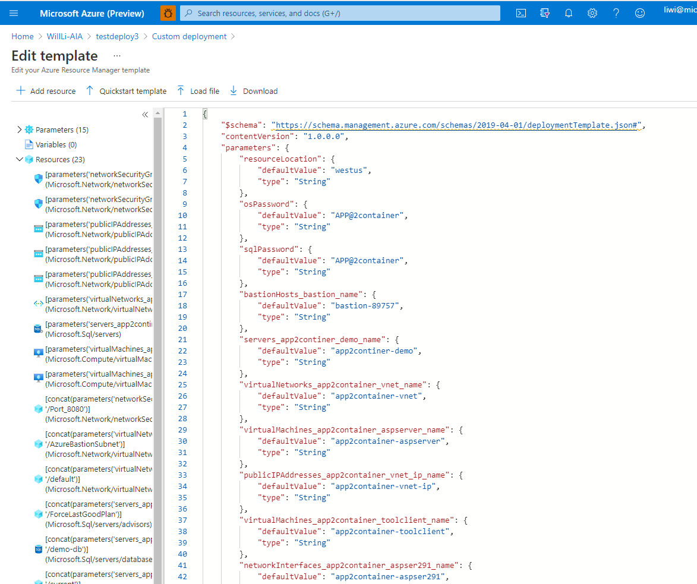
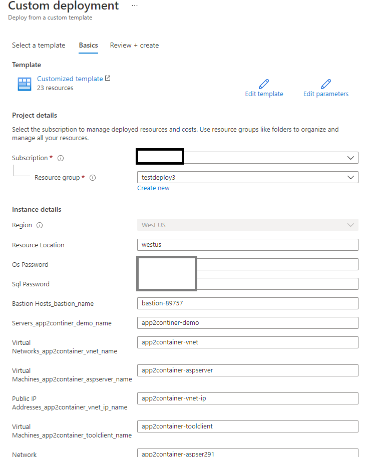
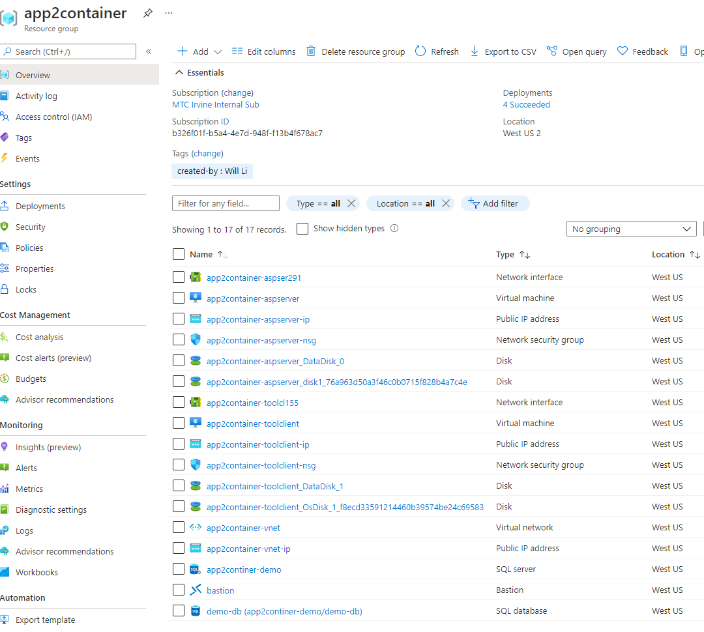
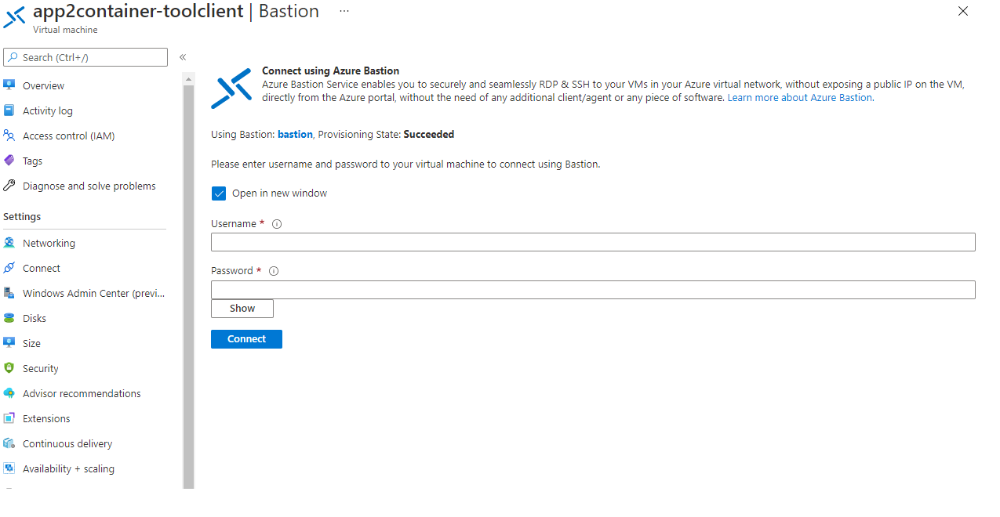

# Demo Environment Setup Instructions

This section gives you guidance on how to setup the environment for the demonstration, as follows:

* Set up an Azure account.
* Deploy the ARM template for the infrastructure including Azure VMs, vNet etc.
* Confirm the environment setups 

> Since it may take more than 15 minutes for the environment to be ready for the demonstration, it is recommended to setup the demo environment before the meeting.

## Prepare an Azure user account

The requirements for the Azure account that associates with the subscription are:
- Owner permissions on the Azure subscription
- Permissions to register Azure Active Directory apps

If you're not the subscription owner, work with the owner to assign the permissions as follows:

1. In the Azure portal, search for "subscriptions", and under **Services**, select **Subscriptions**.

    

2. In the **Subscriptions** page, select the subscription in which you want to create an Azure Migrate project.
3. In the subscription, select **Access control (IAM)** > **Check access**.
4. In **Check access**, search for the relevant user account.
5. In **Add a role assignment**, click **Add**.

    

6. In **Add role assignment**, select the Owner role, and select the account (azmigrateuser in our example). Then click **Save**.

    

7. Your Azure account also needs **permissions to register Azure Active Directory apps.**
8. In Azure portal, navigate to **Azure Active Directory** > **Users** > **User Settings**.
9. In **User settings**, verify that Azure AD users can register applications (set to **Yes** by default).

      

10. In case the 'App registrations' settings is set to 'No', request the tenant/global admin to assign the required permission. Alternately, the tenant/global admin can assign the **Application Developer** role to an account to allow the registration of Azure Active Directory App. [Learn more](https://github.com/MicrosoftDocs/azure-docs/blob/master/articles/active-directory/fundamentals/active-directory-users-assign-role-azure-portal.md).

## Deploy the ARM template for the demonstration

In this section, you deploy the ARM template designed for this demonstration, including all the infrastructure needed:

* **Tool Client Server**: This virtual machine is for installing the Azure Migrate Containerization tool and performing most of the containerization tasks.
* **ASP.NET Application Server**: This virtual machine is for the application server that runs the sample ASP.NET application that will be containerized and deployed in the Azure Kubernetes Service cluster by the tool.
* **Azure Bastion Service**: [Azure Bastion](https://azure.microsoft.com/en-us/services/azure-bastion/) is a fully managed PaaS service that provides secure and seamless RDP and SSH access to the virtual machines for this workshop directly through the Azure Portal.
* **Azure SQL Server"**: The fully managed Azure SQL service that the sample application connect to in this workshop.

To deploy the ARM template, log into the [Azure portal](https://portal.azure.com) using the account you have set up in the previous section. Then create a resource group within the subscription you choose and keep a note on the region that you choose to create the resource group. It is recommended to choose the region that is closest to you geographic area to keep the network latency minimal. Once you have created the resource group, click into the resource group and the **Add** button on the top left tab. Choose the **Custom Deployment** option. Once going into the **Custom Deployment** page, choose **Build your own template in the editor**. Paste the **template.json** file into the editor and click the *save* button. 

In the next page, edit the items for a few parameters for the deployment, including VM password, SQL Server name and password etc.

> *Note: To avoid name conflict of the globally unique Azure SQL server names, try to attach a random number to the end of the string*

Then click the **Review + Create** button to deploy the resources and it may take *15 minutes* to finish the deployment process.

## Confirm environment setups

Once the deployment process finishes, the resources will be created as following:

You can login to the server using Azure bastion to confirm that the VM instance is running. Click the **Tool Client** VM and select **Connect** -> **Bastion**. You will be prompted into filling out login credentials and then clicking the **Connect** button to establish a web browser based RDP connection to the VM.

