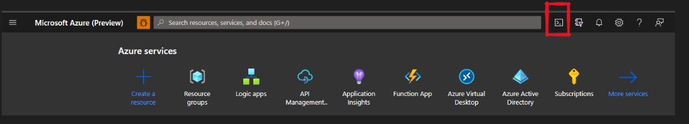
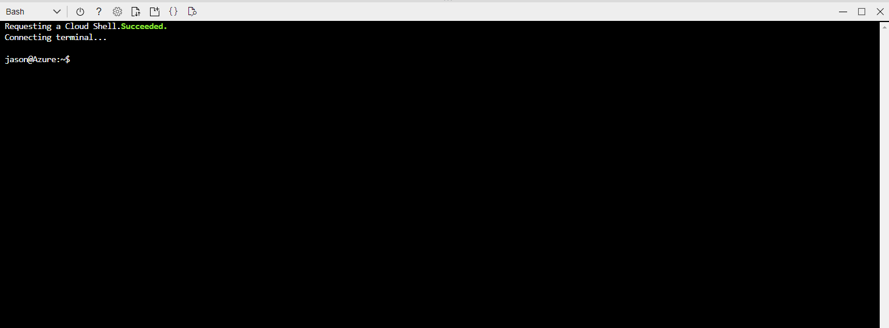
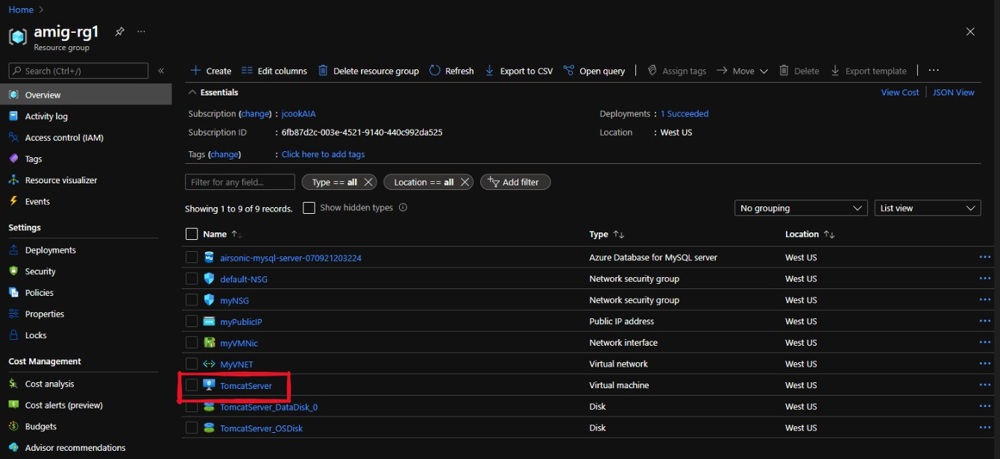
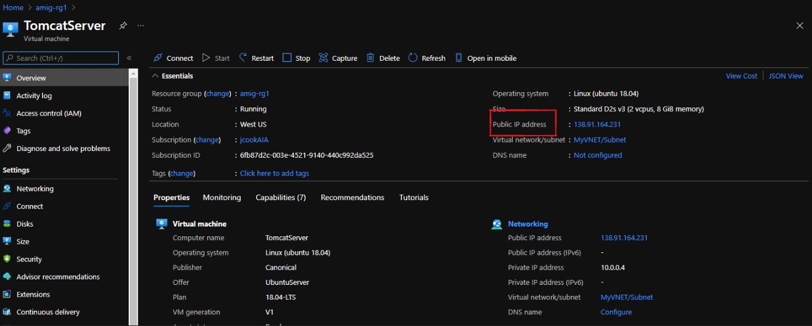
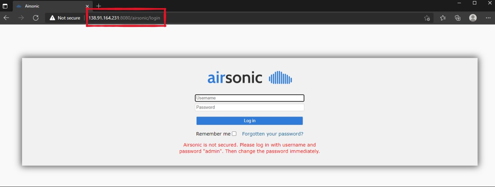

# Airsonic deployment 
Ubuntu/Tomcat/Java/mySQL environment for Azure airsonic app deployment

Ported from https://github.com/selvasingh/tomcat-on-virtual-machine

Fully automated deployment via arm templates and custom scripts

### Port Notes:

* Does not configure transcoding, i.e. sudo snap install ffmpeg
* Binding of airsonic app to mysql first requires the app be started to create a .properties file, stopped, then the .properties needs to be updated with jndi binding.  At the end of the airsonic install, the app is started then stopped to create this file using a 30 second wait period between operations.  The properties file is updated with binding during the mysql binding setup.

## Deployment

To deploy this workshop environment, begin by navigating to the Azure portal at https://portal.azure.com and opening the cloud shell as shown belew:

...

From the terminal window execute the following commands to clone the App Migration Workshop project.  Navigate to the Java migrate sub module and execute the deployment script substituting the target region name and resource group for which the resources will be deployed.

    git clone https://github.com/microsoft/MTC_APPContainerization.git
    cd MTC_APPContainerization/Java\ Containerization/
    chmod +x scripts/deploy.sh
    ./scripts/deploy.sh '<REGION NAME>' '<RESOURCE GROUP>'

For example:

     ./scripts/deploy.sh 'westus' 'jm-rg2'

Total deployment will take ~5 minutes.  When complete navigate to the newly created resource group in the azure portal.  Find the created vm named TomcatServer click on its name.  

Identify the public IP address provisioned for the VM.

Use the IP address to access the Airsonic app at http://{ip}:8080/airsonic

